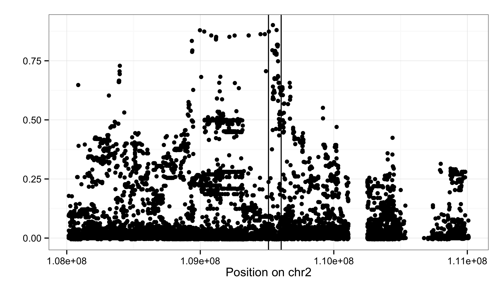
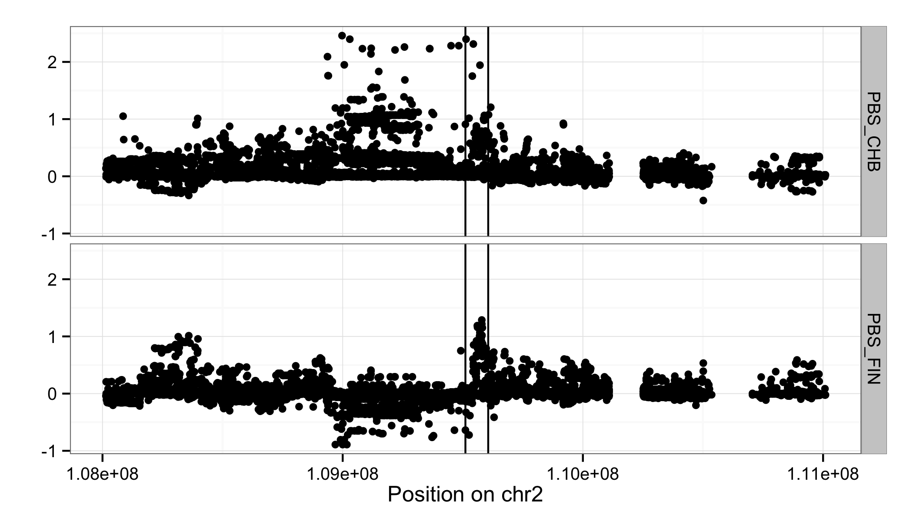
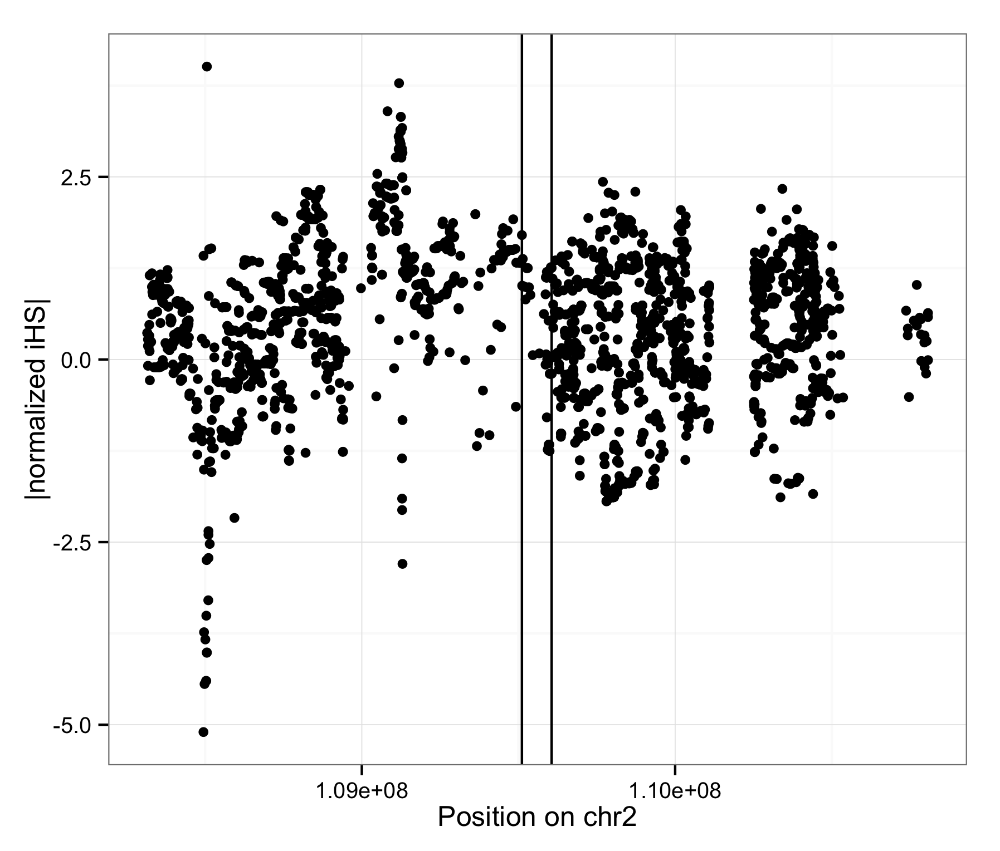
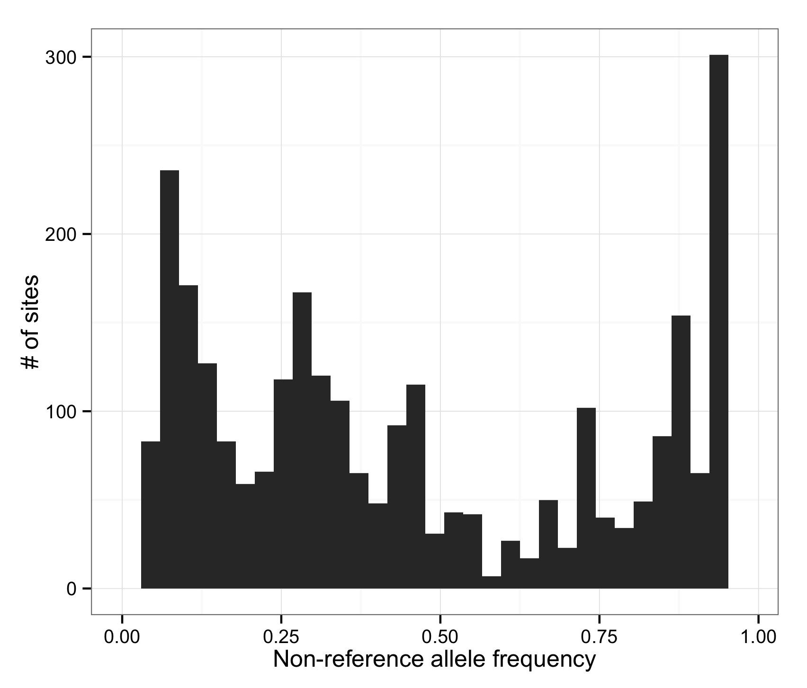
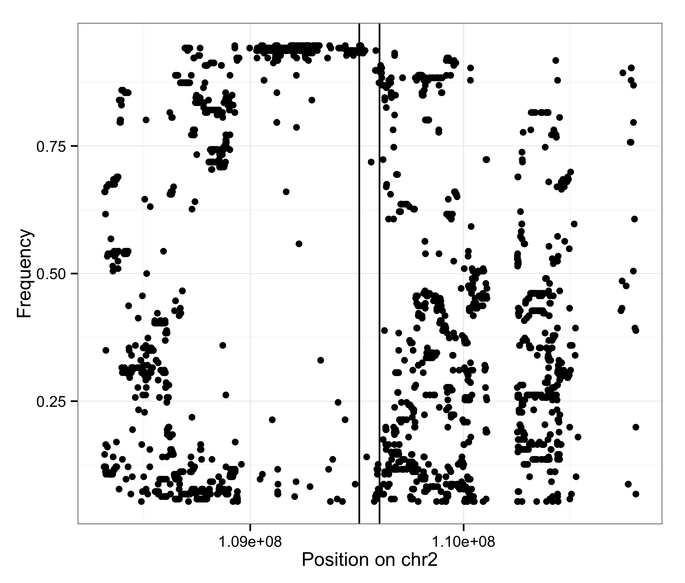

# 1000genomes Selection Exercise


To get some exposure to different approaches for detecting recent positive selection from population genetic data, we will be using the 1000 Genomes data.  We will present two approaches for detecting recent positive selection.  The first is an approach based on differentiation between populations, that uses the PBS (population-branch statistic) to detect selection that occurred in the history of a particular population.  The second is an approach based on haplotype patterns - using the iHS statistic.  We'll suppose a particular gene is of interest (whose transcript start/stop is marked with vertical lines below)

We will interact with the 1000 Genomes data using `vcf` (variant call format) files.  These files have one line per variant, and contain information about each individual's genotype as columns. These files are so large they are most often kept in a `gzip` compressed format, which you will recognize usually by seeing a filename that ends with `.vcf.gz`.  

Before anything, we need to set up a unix-based analysis environment with the appropriate programs:

* `tabix`: For quickly retrieving specific lines from a `.vcf.gz` file.  It creates an index of a `.vcf.gz` file and then uses the index to quickly find the lines a user requests.
* `bcftools`: For manipulating `vcf` files.  Here we use it for some basic filtering.
* `plink2` / `plink-1.9`: Second-generation of the multi-faceted `plink` tool.  It facilitates a number of common analyses in statistical genetics and population genetics.  Here we use it to compute $F_{ST}$ which we will need to compute the PBS statistic.  We assume you will run it using the command `plink-1.9`. 
* `selscan`: For computing haplotype-based statistics that are sensitive to signatures of selective sweeps (EHH, iHS, XP-EHH, nSL, for example)
* `norm`: A program from the `selscan` package that will normalize iHS or XP-EHH values. 

We have included an appendix, titled "Setting up your environment" that contains the appropriate instructions for installing these.  For the moment, we assume you have gone through this, or are using an account on a server that has been pre-configured for you, and so we will jump right into some analysis.  To be sure, check and see if the list of programs above can be found in a 'bin/' subdirectory of the main project directory here. 

As a disclaimer, in what follows - we take an approach that builds intuition and take some shortcuts to make analyses feasible in a classroom setting.  For publishable results, more rigor to assess the statistical significance of results is necessary than what we show here.  

### Preparing files that describe the 1000 Genomes individuals 

To get started, we will want some basic information on the individuals in the 1000 Genomes data.  We also want to simplify our analysis by just focusing on individuals from the CHB (Han Chinese from Beijing), YRI (Yoruba from Ibaden, Nigerai), and FIN (Finnish from Finland).  Let's get started... 

#### Downloading Individual-Level Data [SSS 2015 read-only, data already in data/]

We can download info on the 1000 Genomes phase III individuals with the following commands.  The `integrated_call_samples_v3.20130502.ALL.panel` file we are obtaining contains the sample id and associated population and gender info for each individual. 

```bash
cd data/

# download 1000genomes_phase3 individual information
wget ftp://ftp.1000genomes.ebi.ac.uk/vol1/ftp/release/20130502/integrated_call_samples_v3.20130502.ALL.panel
```
Click [here](http://ftp.1000genomes.ebi.ac.uk/vol1/ftp/README.populations) for a for explanation of the population codes.

#### Setting up `.clst.txt` and `.iids` files for plink and bcftools analyses

In order to extract individuals and define groups for computing selection statistics within we need to prepare a set of `.clst.txt` and and `.iids` files.  You will inspect each file after they are created to see the basic structure of these files (e.g. using the `head` command to see the start of the file and `tail` to see the end of the file). 

The `.iids` files just contain a list of the individual ids we will include in our analysis.  

The `.clst.txt` files define a "cluster" of individuals to consider as a single unit for analysis (e.g, a cluster might represent a population). Here we create a such file for each pair of populations we will be analyzing. 

Here we use `awk` commands - `awk` is very useful unix-based tool for basic file manipulation. 

```bash
# use awk to produce a file that has the format of a .clst.txt file, with IID | IID | CLST for CHB, YRI, FIN
awk 'NR>1{print $1, $1, $2}' integrated_call_samples_v3.20130502.ALL.panel > 1kgv3_clst.txt

# Visually inspect the top and botom of the files. 
head 1kgv3_clst.txt
tail 1kgv3_clst.txt
```

### Downloading data for a specific 3Mb genomic region [SSS 2015 read-only, data already in data/]

Now, let's download a 3Mb part of the the 1000 Genomes Phase3 project data to use. 

```bash
cd data/

# download a 3MB region (chr2:108013601-111013601) from the 1000genomes project and store as .vcf.gz file
tabix -h ftp://ftp.1000genomes.ebi.ac.uk/vol1/ftp/release/20130502/ALL.chr2.phase3_shapeit2_mvncall_integrated_v5a.20130502.genotypes.vcf.gz 2:108013601-111013601 | bgzip -c > 1000genomes_phase3_chr2_108013601_111013601.vcf.gz
```

We will use our list of individual ids from the YRI, FIN, and CHB to extract just those individuals from the larger 1000 genomes data.  We also want to filter out indels and multi-allelic sites. 

```bash
# filter out indels (-V indels), multi-allelic sites (-m 2 -M 2). (Approx 30 sec - 1 min)
bcftools view -v snps -m 2 -M 2 -O z 1000genomes_phase3_chr2_108013601_111013601.vcf.gz > snv_1000genomes_chr2_108013601_111013601.vcf.gz
```

Now we want to filter out sites that violate Hardy-Weinberg equilibrium.  We first calculate genotype genotypes within each cluster.
```bash
tag=chr2_108013601_111013601
plink-1.9 --vcf snv_1000genomes_$tag.vcf.gz \
          --within 1kgv3_clst.txt \
          --hardy midp\
          --keep-cluster-names FIN \
          --out tmp_fin
plink-1.9 --vcf snv_1000genomes_$tag.vcf.gz \
          --within 1kgv3_clst.txt \
          --hardy midp\
          --keep-cluster-names CHB \
          --out tmp_chb
plink-1.9 --vcf snv_1000genomes_$tag.vcf.gz \
          --within 1kgv3_clst.txt \
          --hardy midp\
          --keep-cluster-names YRI \
          --out tmp_yri
# Pull out all SNPs that fail HWE (with a loose criterion) in at least one population test
awk '$9<1e-5{print $2}' tmp_fin.hwe tmp_chb.hwe tmp_yri.hwe | sort | uniq > tmp.exclude.txt

# Filter out HW failures 
bcftools view snv_1000genomes_$tag.vcf.gz --exclude 'ID=@tmp.exclude.txt' -O z > snv_1000genomes_${tag}_HWEfiltered.vcf.gz

```

Note a more rigorous appraoch is to conduct a $\chi^2$ test for the joint set of genotype counts for each sub-population (in this case a 5 degree of freedom test).

## Population-differentation-based selection scan

One approach to detecting recent positive selection is to see if a local genomic region shows extensive differentiation between *two* populations (using a population differentiation statistic such as $F_{ST}$ or a more formal inferential methods like [BayesScan](http://cmpg.unibe.ch/software/BayeScan/) not shown here).  Let's do this for the CHB vs FIN comparison for our focal region.

### Computing pairwise $F_{ST}$s

```bash
# Fst between CHB and FIN
plink-1.9 --vcf snv_1000genomes_${tag}_HWEfiltered.vcf.gz \
          --fst \
          --within 1kgv3_clst.txt \
          --out CHB_FIN_${tag}_HWEfiltered \
          --keep-cluster-names FIN CHB
```             


#### Visualizing pairwise $F_{ST}$ values

In another terminal window or screen open an R session that we will be using for the rest of the workshop. Now run these commands in the R session.  Make sure your working directory in R is set to the data subdirectory.  (Use the "Session" tab or setwd() command to change your working directory, e.g. setwd("~/git/1000genomes_Selection_Exercise/data")).

```R
library(dplyr)
library(ggplot2)
library(reshape2)

# read data
fst_CHB_FIN_df <- read.table('CHB_FIN_chr2_108013601_111013601_HWEfiltered.fst', header = TRUE) %>% 
                  rename(FST_CF = FST) %>% 
                  filter(is.nan(FST_CF) == FALSE) %>% 
                  select(SNP, POS, FST_CF)

# Prepare the plot
fst_CHB_FIN_plot <- ggplot(fst_CHB_FIN_df, aes(x = POS, y = FST_CF)) + geom_point() + xlab('Position on chr2') + 
     theme_bw() + ylab("") + geom_vline(xintercept = 109510927)+geom_vline(xintercept = 109605828)

# View the plot
fst_CHB_FIN_plot + ggsave('../results/fst_CHB_FIN_plot.png',width=7,height=4)

```

#### Questions

1.  Suppose the 99.9th percentile of $F_{ST}$ between CHB and FIN genome-wide is 0.5.  Do you see any variants in this 3Mb region that are among the most differentiated in the genome?  
2.  Can you assess from this data whether selection took place just in CHB, FIN, or both? 


### PBS

A drawback of such an approach is we do not know which of the two populations (or if both) have experienced selection causing the allele frequencies to differentiate.  Using *three* populations, we can compute a statistic that isolates a single populations. Specifically we compute an estimate of how much differentiation occured on the branch leading to a particular popualtion in a three-population tree consiting of a focal population, a sister population, and an outgroup population.  These `PBS` statistics are based on $F_{ST}$, so we start by computing pairwise $F_{ST}$ values. 

```bash
# Fst between CHB and YRI
plink-1.9 --vcf snv_1000genomes_${tag}_HWEfiltered.vcf.gz \
          --fst \
          --within 1kgv3_clst.txt \
          --out CHB_YRI_chr2_108013601_111013601_HWEfiltered \
          --keep-cluster-names CHB YRI
          
          
# Fst between FIN and YRI
plink-1.9 --vcf snv_1000genomes_${tag}_HWEfiltered.vcf.gz \
          --fst \
          --within 1kgv3_clst.txt \
          --out FIN_YRI_chr2_108013601_111013601_HWEfiltered \
          --keep-cluster-names FIN YRI
```

Let's now compute the PBS statistic for the FIN and the CHB to see if we can determine which population the selection occurred in. 

$$ T = -log(1 - Fst) $$
$$ PBS_{CHB} = \frac{T_{CY} + T_{CF} - T_{FY}}{2} $$
$$ PBS_{FIN} = \frac{T_{FY} + T_{CF} - T_{CY}}{2} $$

```R
fst_CHB_YRI_df <- read.table('CHB_YRI_chr2_108013601_111013601_HWEfiltered.fst', header = TRUE) %>% 
                  rename(FST_CY = FST) %>% 
                  filter(is.nan(FST_CY) == FALSE) %>% 
                  select(SNP, POS, FST_CY) 
              
fst_FIN_YRI_df <- read.table('FIN_YRI_chr2_108013601_111013601_HWEfiltered.fst', header = TRUE) %>% 
                  rename(FST_FY = FST) %>% 
                  filter(is.nan(FST_FY) == FALSE) %>% 
                  select(SNP, POS, FST_FY) 

# join fst data frames and compute pbs                
pbs_df <- fst_CHB_FIN_df %>%
          inner_join(fst_CHB_YRI_df, by = c("SNP", "POS")) %>%
          inner_join(fst_FIN_YRI_df, by = c("SNP", "POS")) %>%
          mutate(T_CY = -log(1 - FST_CY), T_CF = -log(1 - FST_CF), T_FY = -log(1 - FST_FY)) %>%
          mutate(PBS_CHB = (T_CY + T_CF - T_FY) / 2) %>%
          mutate(PBS_FIN = (T_CF + T_FY - T_CY) / 2) %>%
          select(POS, PBS_CHB, PBS_FIN)

# melt data for faceting in ggplot
melted_pbs_df <- melt(pbs_df, id = c("POS"))
  
# plot!        
PBS_plot <- ggplot(melted_pbs_df, aes(x = POS, y = value)) + geom_point() + xlab('Position on chr2') + 
     theme_bw() + ylab("") + facet_grid(variable ~ .)+ geom_vline(xintercept = 109510927)+geom_vline(xintercept = 109605828)
PBS_plot + ggsave('../results/PBS_plot.png',width=7,height=4)
```

#### Questions

1. What is the major difference between the PBS values in this region for CHB vs Finland? 
2. Draw the 3 population tree of (CHB, FIN, YRI) and mark which branch is extended the most in this region. 
3. In which population would one conclude that there has been the most accelerated differentiation?
4. (Advanced) What are some possible interpretations for when the PBS statistic becomes negative? 

## iHS

Now's let turn towards looking at haplotype-based signatures of selection.  We'll focus on the CHB for this analysis, so we'll begin by preparing a new data file with just the CHB individuals.  

We will filter the file to only include variants with minor allele frequency >5%.  In principle the rare variants increase our power, but for efficiency's sake we'll exclude them here, as most of the information for these statistics comes from common variants. 

```bash

# write a file of just IIDs from CHB 
awk '($3 == "CHB") {print $1}' 1kgv3_clst.txt > CHB_iids.txt

# keep CHB individuals from the filtered vcf and filter out rare variants (at maf < 5%)
# this will be used for haplotype based selection analysis.
bcftools view -S CHB_iids.txt \
         -q '.05 minor' \
         -O z \
         snv_1000genomes_${tag}_HWEfiltered.vcf.gz > CHB_${tag}_HWEfiltered.vcf.gz
```

Haplotype-based methods use recombination rates between markers to calibrate the extent of haplotype homozygosity observed.  To that end, we need to set up a list of all the markers in the format of a plink `.bim` file, and interpolate a genetic map at each of those positions.  Here are the steps:  
```bash
# write bim file from vcf (-H supress header)
bcftools view CHB_${tag}_HWEfiltered.vcf.gz \
          -H | awk '{print $1, $3, "0", $2, $4, $5}' > CHB_${tag}_HWEfiltered.bim

# get genetic positions and interpolate genetic positions for variants not present in the genetic_map
plink-1.9 --bim CHB_${tag}_HWEfiltered.bim \
          --cm-map genetic_map_chr2_combined_b37.txt 2 \
          --make-just-bim \
          --out ${tag}_HWEfiltered_gm
          
# format as map file
awk '{print $1, $2, $3, $4}' ${tag}_HWEfiltered_gm.bim > ${tag}_HWEfiltered_gm.map

# Inspect the map file - the columns are <CHR> <POS> <Position in centiMorgans> <Position in physical space> 
head ${tag}_HWEfiltered_gm.map
```

Now we can finally play!  This selscan command will compute iHS values for us, and the norm command normalizes them to have mean 0 and standard deviation 1 (which is useful for assessing outlier values).

This command will take about 5 minutes.  If you're short on time, the results have been copied to the `1000genomes_Selection_Exercise/results/` directory (`CHB_chr2_108013601_111013601_HWEfiltered.ihs.out` and `CHB_chr2_108013601_111013601_HWEfiltered.ihs.out.100bins.norm`). 

```bash
# compute iHS! This will take about 5 minutes 
selscan --ihs \
        --vcf CHB_${tag}_HWEfiltered.vcf.gz \
        --map ${tag}_HWEfiltered_gm.map \
        --out CHB_${tag}_HWEfiltered
```

Normally we would normalize the iHS -- but because we are only using a 3Mb region
the normalization makes little sense.  Here's what the command would like if we actually ran it.
```bash
# norm --ihs --bins 20 --files CHB_${tag}_HWEfiltered.ihs.out 
```

#### Make plot of iHS scores

Let's make a plot of the iHS values in this region. 

```R
# read iHS data
ihs_df <- read.table("CHB_chr2_108013601_111013601_HWEfiltered.ihs.out", header = FALSE)
colnames(ihs_df) <- c("SNP", "POS", "FREQ", "ihh1", "ihh0", "unstd_iHS")

IHS_plot<-ggplot(ihs_df, aes(x = POS, y = unstd_iHS)) + geom_point() + xlab('Position on chr2') + theme_bw() + ylab("|normalized iHS|") + geom_vline(xintercept = 109510927)+geom_vline(xintercept = 109605828)

IHS_plot + ggsave("../results/IHS_plot.png")
```

#### Questions
1.  Are there any provocative outliers among the iHS scores?
2.  Suppose you are unconvinced that there are interesting patterns of iHS in this region - is it possible that the PBS signal in this region is real?  Put another way - does positive selection in the past necessarily leave a signature in the iHS score of a population observed today?

#### Make a plot of allele frequencies

It also possible to make a plot representing allele frequencies in the region: 
```R
freq_plot<-ggplot(ihs_df, aes(x = POS, y = FREQ)) + geom_point() + xlab('Position on chr2') + theme_bw() + ylab("Frequency") + geom_vline(xintercept = 109510927)+geom_vline(xintercept = 109605828)

freq_plot + ggsave("../results/freq_plot.png")
```
Or a histogram of the frequencies (an allele frequency spectrum):

```R

hist(ihs_df$FREQ,xlab="Non-reference frequency", ylab="# of SNPs",main="Allele frequency spectra",breaks=100)

png("allele_frequency_spectra.png",width=5in,height=3in)
hist(ihs_df$FREQ,xlab="Non-reference frequency", ylab="# of SNPs",main="Allele frequency spectra",breaks=100)
dev.off()
```

#### Questions
1.  Non-reference alleles are typically derived (i.e. novel alleles relative to the ancestral allele) - so for simplicity sake let's assume they are. Does the allele frequency distribution seen here seem consistent with selection?  Why or why not?

## Additional Regions 

The 1000 Genomes selection browser (http://hsb.upf.edu/) allows one to quickly browse various selections statistics that have been computed for major populations from the project.  

Take a look at a few random regions of the genome of your choice.  Compare what you see for the iHS and Fst tracks for the region surrounding the lactase gene LCT (near the gene there are varaints affecting the persistence of lactase expression), SLC24A5 (a gene affecting skin pigmentation), and for KITLG (another gene affecting skin pigmentation).  These are all genes that have been argued to show signatures of recent positive selection in humans, presumably as adaptations to novel environments (specifically high latitudes with low sunlight in the case of the skin pigmentation, and to dairy culture in the case of lactase)

## Being cautious about selective scans

In a classic paper from 1979 Stephen J Gould and Richard Lewontin wrote eloquently about how easy it is to fall into the intellectual trap of taking an adaptationist worldview and explaining all features of organismal biology as due to the direct outcome of natural selection.   Some features may be indirectly selected or due to chance events and genetic drift. While population genetic approaches provide more rigor, the tests are still ultimately statistical, and there is often a non-negigible chance of confusing patterns due simply due to genetic drift with those of selection.  With that in mind, we should be critical (as with GWAS) about constructing just-so stories about a plausible gene without doing additional functional follow-up or gathering other lines of evidence to support a claim about recent positive selection acting on a locus. Some useful perspectives on selective sweeps are Teshima et al (2006, Genome Research) and Fu and Akey (2013, Annual Review of Genomics and Human Genetics)

## References

* `tabix` : (http://www.htslib.org/doc/tabix.html)
* `bcftools` : (https://samtools.github.io/bcftools/bcftools.html)
* `plink-1.9` : Chang CC, Chow CC, Tellier LCAM, Vattikuti S, Purcell SM, Lee JJ (2015) Second-generation PLINK: rising to the challenge of larger and richer datasets. GigaScience, 4.  (https://www.cog-genomics.org/plink2)
* `selscan` : ZA Szpiech and RD Hernandez (2014) selscan: an efficient multi-threaded program 
  to calculate EHH-based scans for positive selection. Molecular Biology and Evolution, 
	31: 2824-2827. (https://github.com/szpiech/selscan)
* iHS: Voigt et al (2006) A Map of Recent Positive Selection in the Human Genome. PloS Genetics 4(3): e72.
* PBS: Yi et al (2010) Sequencing of 50 Human Exomes Reveals Adaptation to High Altitude. Science 329:75-78.


## Appendix: Setting up your Environment 

### Downloading and Building Methods

This section can be skipped for now as the software tools are already built on the cluster. This can be used if you'd like to use these methods later. For now, scoll down to *Downloading Data*.

#### Download

```bash
mkdir src
cd src/

# download tabix
git clone https://github.com/samtools/tabix

# download htslib & bcftools
wget http://sourceforge.net/projects/samtools/files/samtools/1.2/htslib-1.2.1.tar.bz2
wget http://sourceforge.net/projects/samtools/files/samtools/1.2/bcftools-1.2.tar.bz2

# clone selscan
git clone -b devel https://github.com/szpiech/selscan

# download plink (double check that the correct OS is specified)
# For linux:
wget https://www.cog-genomics.org/static/bin/plink150602/plink_linux_x86_64_dev.zip
# For mac:
wget https://www.cog-genomics.org/static/bin/plink150615/plink_mac.zip
```

#### Build

```bash
# make a bin directory under main directory if not there already
mkdir ../bin/

# tabix
cd tabix/
make
mv tabix ../../bin/

# bcftools
cd ../
tar xvjf htslib-1.2.1.tar.bz2
tar xvjf bcftools-1.2.tar.bz2
cd bcftools-1.2/
make
mv bcftools ../../bin/

# plink
cd ../
mkdir plink
unzip plink_linux_x86_64_dev.zip -d plink
mv plink/plink ../bin

# selscan
cd selscan/

# open Makefile make sure the correct OS is specified 
cd src/ 
make
mv norm ../../../bin/
mv selscan ../../../bin/

# lets go home
cd ../../../
ls bin/

mv bin/plink bin/plink-1.9
# you should see binaries for tabix, bcftools, plink, selscan, and norm

# Add the current directory (bin) to the export path using this command
export PATH=$(pwd):$PATH
```

## Brief Answer Key:

#### $F_{ST}$ plot questions
1. Yes - There is a broad window of SNPs with a peak right in a specfic gene (marked by vertical lines)
2. No - the population(s) in which selection is occuring is not clear. 

#### PBS plot questions
1. The signal of high PBS is broader and larger for CHB vs FIN.
2. The branch to CHB is most extended
3. CHB
4. PBS can become negative because of sampling variance ($F_{ST}$ values estimated with noise), becuase of genetic drift, and when there is selection acting between the outgroup and sister population the focal population.

#### iHS plot questions
1. Yes, but not near our focal gene (marked by the vertical lines)
2. Yes, it could have been a soft sweep that leaves a signature in PBS but not iHS.

#### Frequency plot questions
1. The allele frequency distribution shows many high frequency derived variants consistent with selection.  They also overlap the region where the PBS is high.


## Answer Key: Plots








